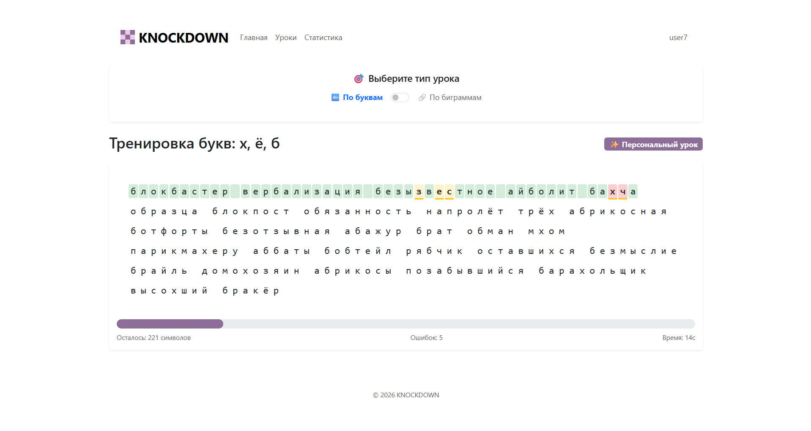
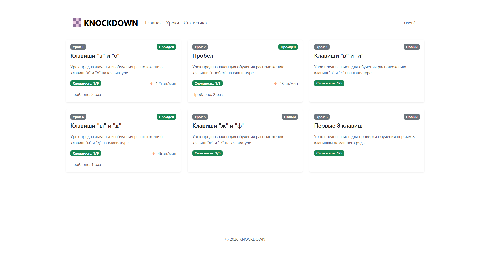
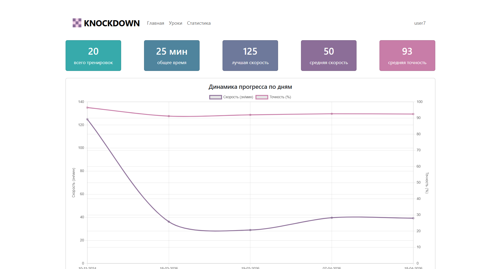
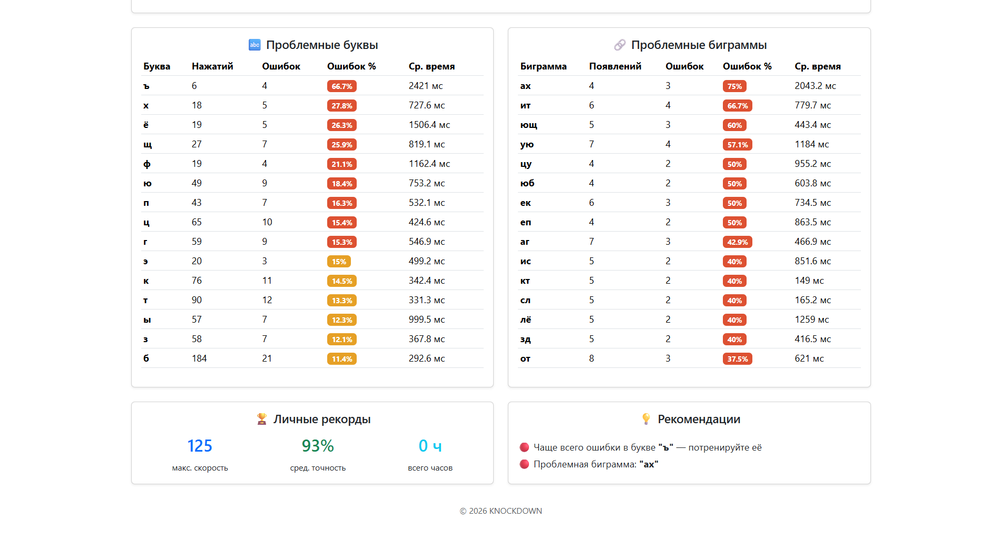

# KNOCKDOWN - frontend

Клиентская часть веб-приложения для обучения слепому методу печати с адаптивной системой упражнений.

> [!NOTE] 
> Серверная часть веб-приложения доступна в репозитории [knockdown-backend](https://github.com/icnsat/knockdown-backend).

## Используемые технологии

- Node.js
- React
- Bootstrap

Веб-приложение развёрнуто на хостинге Vercel, но может работать и локально. 

## Установка и запуск

Для установки зависимостей выполнить команду:

```sh
npm i
```

В приложении находится .env файл с конфигурацией URL адреса для API веб-приложения. Если файла нет или URL не задан, по умолчанию используется адрес `http://localhost:8000/api`. Пример `.env` файла: 

```.env
REACT_APP_API_BASE_URL=http://localhost:8000/api
```

Для запуска приложения выполнить команду:

```sh
npm start
```

Клиент будет запущен на `localhost:3000`.


|  |  |
|-|-|
|  |  |


<!--

TODO:
1) Темная тема

-->